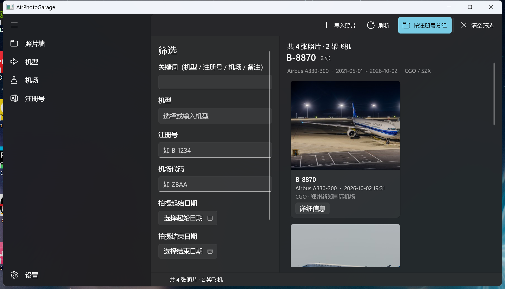
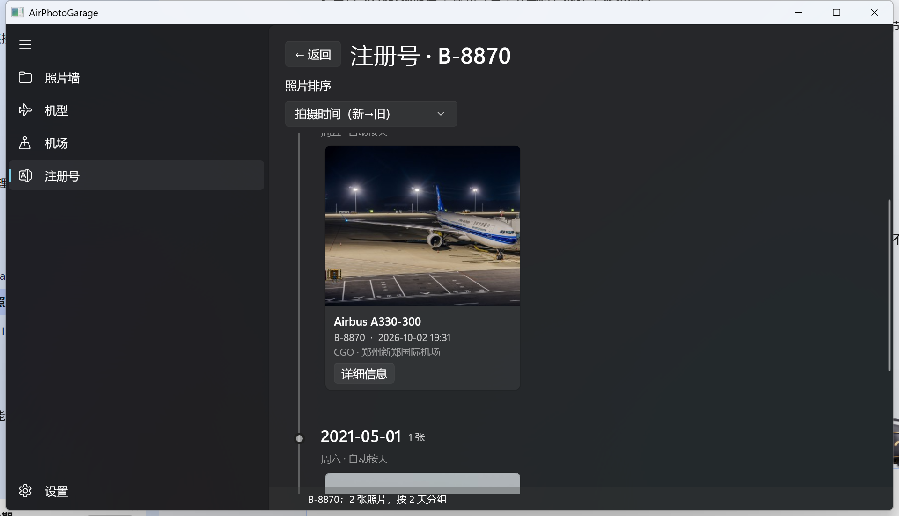
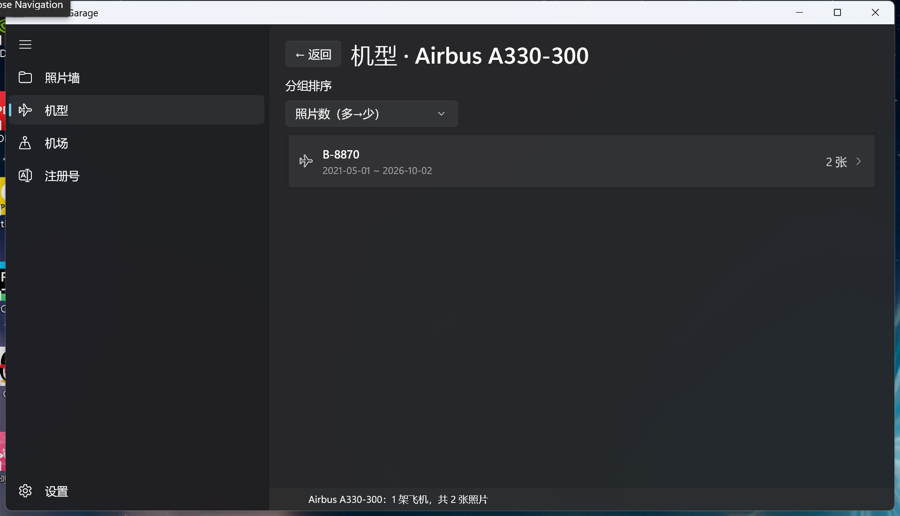
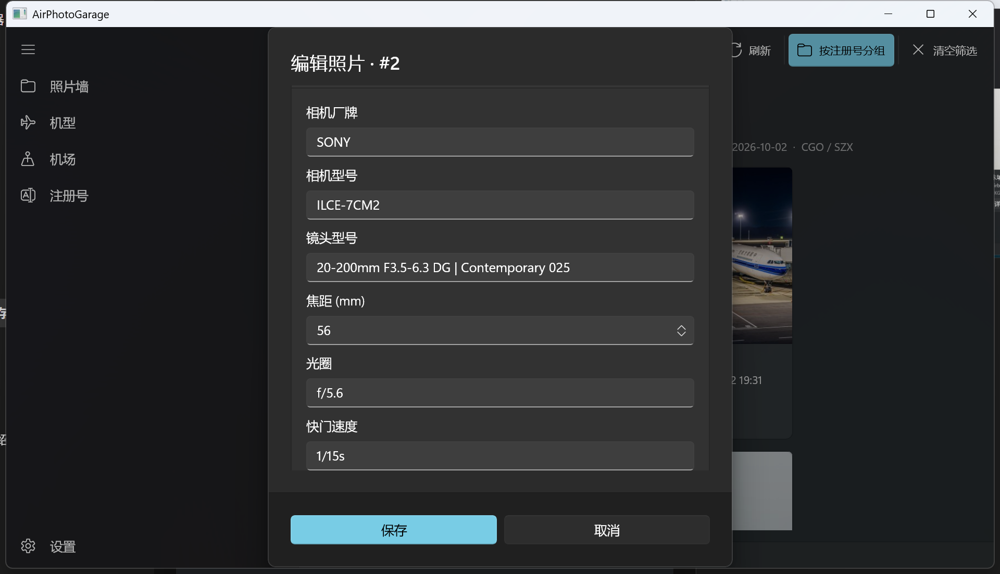

<div align="center">

# Air Photo Garage

**整理、统计并检索你拍过的每一架飞机 —— 按注册号归档，按天串成时间轴**

一个面向航空摄影爱好者的本地照片管理工具（Windows 桌面应用）


</div>

---

## 为什么做这个

拍飞机的人都有同一个痛点：照片散在硬盘里，想找「那架 B-8870 我什么时候拍的、在哪个机场」只能一张张翻。

关键在于：**机型（如 A330-300）是共享的**，一次航展可能拍到十几架同型机，光按机型分组没有意义；
**只有注册号唯一标识一架具体的飞机**。所以本项目以注册号为主线来组织照片。

## 功能

### 照片墙
- 按注册号自动聚组（可随时开关），组头显示机型 / 时间跨度 / 出现过的机场
- 筛选：关键词 + 机型 / 注册号 / 机场（带自动补全）+ 拍摄日期区间
- 排序：拍摄时间 / 导入时间 / 机型 / 注册号
- 卡片右键：查看详情 · 编辑信息 · 删除

### 三个分组浏览维度

| 页面 | 层级结构 | 说明 |
|---|---|---|
| **机型** | 机型 → 注册号 → 照片 | 机型是共享的，必须先下钻到具体哪一架飞机 |
| **机场** | 机场 → 按天时间轴 | 行标题显示「香港国际机场 · HKG」，名字比代码好认 |
| **注册号** | 注册号 → 时间轴 | 同一架飞机的所有照片集中在一处 |

三个页面都支持「未填写」兜底行，信息不全的照片不会从列表里消失。

### 时间轴与自定义分组（注册号页）

- **按天自动分组**：同一天拍的照片自动归为一个节点
- **自定义命名分组**：右键照片 →「加入分组…」，例如「2024 珠海航展」
- 垂直轴线 + 节点圆点，自定义分组用强调色、按天用中性色
- 一张照片**最多归属一个分组**：进了自定义分组就自动从按天节点移出，
  所以每张照片在时间轴上**只出现一次**，不会重复统计

### 导入与编辑

- 导入时自动读取 EXIF：拍摄时间、相机厂牌/型号、镜头、焦距、光圈、快门、ISO、GPS
- 机场三字段联动（IATA ↔ ICAO ↔ 机场名，内置机场目录自动补全）
- 「编辑信息」可修改：**拍摄时间**、机型、注册号、机场三项、**相机与镜头参数**、备注

## 截图

**照片墙 —— 按注册号分组**



**注册号页 —— 时间轴 + 自定义分组**



**机型页 —— 机型 → 注册号 → 照片**



**编辑信息 —— 可改拍摄时间与相机参数**



## 系统要求

| 项 | 要求 |
|---|---|
| 系统 | Windows 10 1809（17763）或更高 / Windows 11 |
| 架构 | x64 / ARM64 |
| 运行时 | 安装包**已自带** Windows App SDK 运行时，无需另外安装 |
| 磁盘 | 安装约 100 MB；照片库占用取决于你的照片数量 |

## 安装

### 方式一：MSIX 安装包（推荐）

1. 从 [Releases](../../releases) 下载 `AirPhotoGarage_X.Y.Z_x64.msix` 和 `devcert.cer`
2. **先信任证书** —— 用**管理员**身份打开 PowerShell，执行：

   ```powershell
   certutil -addstore TrustedPeople devcert.cer
   ```

3. 安装（双击 msix 也可以）：

   ```powershell
   Add-AppxPackage -Path AirPhotoGarage_X.Y.Z_x64.msix
   ```

> **为什么装之前要先信任证书？**
> 这个包用**自签名开发证书**签名（省掉付费代码签名证书）。
> 证书只用来标识发布者身份，不联网、不收集任何信息。
> 用完后可以在「管理用户证书」里删掉。

### 方式二：单文件 exe

从 Releases 下载 `AirPhotoGarage_X.Y.Z_x64.exe`，双击即可，**无需安装、无需信任证书**。

> ⚠️ **两条实测限制，请先看完再选：**
>
> 1. **体积约 580 MB**。因为把 .NET 10 与 Windows App SDK 运行时都打进去了 ——
>    好处是用户不用另装任何运行时，代价就是体积。
> 2. **在启用了「智能应用控制」或 WDAC 代码完整性策略的机器上无法启动。**
>    单文件模式会把程序集解压到 `%TEMP%\.net\<应用名>\<哈希>\` 再加载，
>    而未签名的程序集会被这类策略直接拒绝（实测抛 `FileLoadException`）。
>    这类机器请改用上面的 MSIX 安装包 —— 那是本机唯一验证可行的分发方式。

### ⚠️ 已知限制：Windows 智能应用控制（SAC）

Windows 11 的**智能应用控制**会拦截「无法验证发布者」的应用。本项目没有商业代码签名证书，
所以在这类机器上可能出现：

> 智能应用控制已阻止可能不安全的应用

处理办法（三选一）：

1. **先信任证书再装 MSIX**（上面的步骤 2），通常即可放行
2. 临时关闭：`Windows 安全中心 → 应用和浏览器控制 → 智能应用控制 → 关闭`
   ⚠️ 关闭是**单向操作**，重新开启需要重装系统，请自行权衡
3. 换一台未开启 SAC 的机器

另外，如果机器启用了 **WDAC / VBS 代码完整性策略**，未签名的原生 DLL
（例如 `Microsoft.WinUI.dll`）会被拒绝加载 —— 这种情况下**只有 MSIX 能跑**。

## 首次启动

首次运行会弹出欢迎向导，让你**先确定照片库位置**（默认 `%LocalAppData%\AirPhotoGarage`）。
之后可以随时在「设置」里更改（更改后需重启应用生效）。

## 数据存放

| 内容 | 位置 |
|---|---|
| 数据库 | `<照片库根目录>\library.db`（SQLite） |
| 原图 | `<照片库根目录>\Photos\<年>\...`（导入时复制进来） |
| 缩略图 | `<照片库根目录>\Thumbnails\` |

> **删除照片只从数据库移除记录，磁盘上的文件不会被删除**，不会误删你的原始素材。

## 从源码构建

### 环境

- [.NET 10 SDK](https://dotnet.microsoft.com/download)
- Visual Studio 2022（可选，装「Windows 应用开发」工作负载）
- Windows 10 1809 或更高

### 日常开发

```bash
git clone https://github.com/Kai-le1212/Air-Photo-Garage.git
cd Air-Photo-Garage

# 打包/非打包模式启动（Debug）
./run.cmd                  # 打包模式（MSIX 身份，最接近正式运行环境）
./run.cmd /unpackaged      # 非打包模式
./run.cmd /release         # Release 配置
./run.cmd /build           # 只编译不启动
```

### 仅编译

```bash
dotnet build -c Release
```

### 打 MSIX 安装包

```bash
WINAPP="$HOME/.nuget/packages/microsoft.windows.sdk.buildtools.winapp/0.7.1/tools/win-x64/winapp.exe"

# 生成开发自签名证书（首次）
"$WINAPP" cert generate --manifest Package.appxmanifest \
    --output devcert.pfx --export-cer

# 打包 + 签名（自包含运行时，用户无需另装 Windows App SDK）
"$WINAPP" package AirPhotoGarage.csproj -c Release --arch x64 --self-contained \
    --cert devcert.pfx --cert-password <你的密码> \
    --output "AirPhotoGarage_<版本>_x64.msix"

# 验证签名
"$WINAPP" tool signtool verify //pa "AirPhotoGarage_<版本>_x64.msix"
```

### 打包为单文件 exe

```bash
dotnet publish -c Release -r win-x64 --self-contained \
  -p:PublishSingleFile=true \
  -p:WindowsPackageType=None \
  -p:WindowsAppSDKSelfContained=true \
  -p:Platform=x64 \
  -o bin/single-exe
```

## 项目结构

```
AirPhotoGarage.csproj        项目文件（版本号在这里，共 3 处）
Package.appxmanifest         MSIX 清单（版本号在这里）
run.cmd                      启动脚本（打包/非打包、Debug/Release）
App.xaml(.cs)                应用入口、服务与 ViewModel 的组装
MainWindow.xaml(.cs)         NavigationView 外壳 + 页面导航
MainPage.xaml(.cs)           照片墙（筛选面板 + 分组/平铺视图）
Models/                      数据模型（Photo / PhotoGroup / PhotoFilter / Airport）
Services/
  DatabaseService.cs         SQLite 数据访问层，所有 SQL 集中在此
  ExifService.cs             EXIF 读取（MetadataExtractor）
  AirportCatalogService.cs   内置机场目录（ICAO ↔ IATA ↔ 名称）
  AircraftCatalogService.cs  机型目录
  PhotoImportService.cs      导入流程（复制文件 + 生成缩略图）
ViewModels/                  MVVM 视图模型
Views/
  GroupedPhotoPage.xaml      机型 / 机场 / 注册号共用的分组页
  PhotoEditDialog.cs         编辑信息对话框
  PhotoGroupDialog.cs        自定义分组对话框
  PhotoDetailBuilder.cs      详情对话框构建
```

## 版本号规则

本项目使用四位版本号：

- **有新增功能** → 升第三位：`0.2.x.0`
- **没有新增功能**（修复 / 调整 / 重构） → 升第四位：`0.2.0.x`

每次发布的版本号唯一。改版本号要同步 4 处：
`AirPhotoGarage.csproj` 的 `Version` / `AssemblyVersion` / `FileVersion`，
以及 `Package.appxmanifest` 的 `Identity Version`。

## 技术栈

| 层 | 选型 |
|---|---|
| UI | WinUI 3（Windows App SDK）+ CommunityToolkit.WinUI Controls |
| MVVM | CommunityToolkit.Mvvm（源生成器） |
| 数据 | SQLite（Microsoft.Data.Sqlite） |
| EXIF | MetadataExtractor |
| 目标框架 | `net10.0-windows10.0.26100.0`，最低支持 17763 |

## 贡献

欢迎提 [Issue](../../issues) 和 Pull Request。
提 PR 前请确保 `dotnet build -c Release` 无警告无错误。

## 许可

[GPL-3.0](LICENSE)

<div align="center">

*开始开发于 2026.10.07*

</div>
